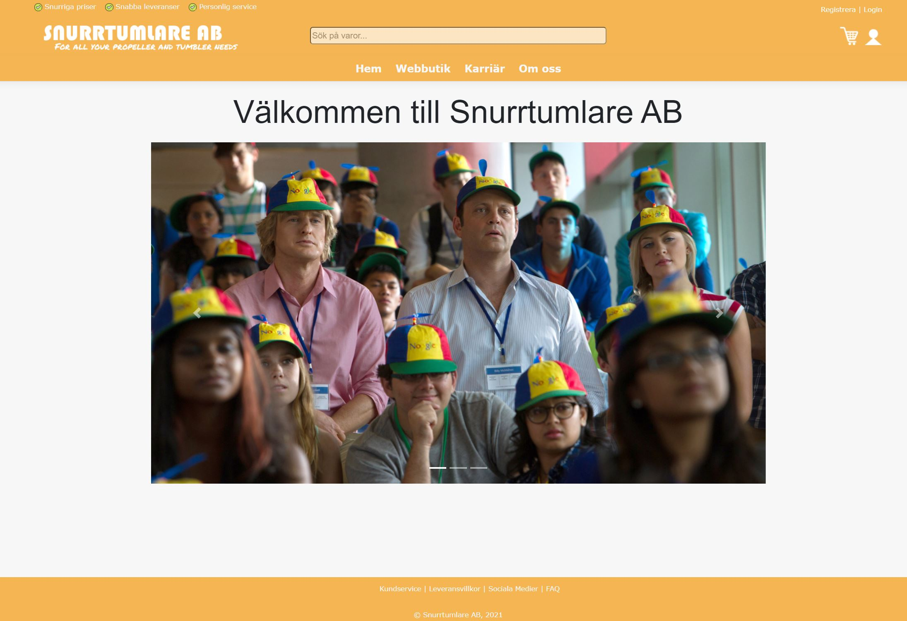

# Propeller_Torktumlar_Service

Projektet är ett skolprojekt med syftet att skapa en webbapplikation i form av en nätbutik med två olika vyer, en kundvy och en administratörsvy. Målet är att kunden skall kunna lägga order i butiken på artiklar som torktumlare och propellerkepsar. Administratörerna skall kunna logga in och bland annat se kundorder.

-- Noteringar till utvecklare --

* Branch-namn skall med fördel börja med följande taggar beroende på syftet med branchen:
  - fix (fix av en felaktighet)
  - addition (ny funktionallitet eller nya designelement)
  - change (ändringar i befintlig kod eller design utan att det är en bug inblandad)

* Db-migration instruktioner
  - För ett cleant project, radera både aspnet-SnurrtumlareWebSite och SnurrtumlareDB databaserna från SQL Server/localdb.
  - Radera hela Migrations mappen från projektet.
  - I Package Manager Console kör nedan komandon för att skapa databaserna och seeda dummy data.
    - add-migration InitialApplicationDbContext -context ApplicationDbContext
    - update-database -context ApplicationDbContext
    
    - add-migration InitialSnurrtumlareDbContext -context SnurrtulareDbContext
    - update-database -context SnurrtulareDbContext

* Inloggnings Instruktioner för admin
  - Email: send_me_your_prayers@abdi.com
  - Password: GudÄrGrejt1337!

* Designregler för alla Views (som renderas genom @RenderBody) --
  - Padding: 15 px
  - Margin(top och bottom): 20px 

